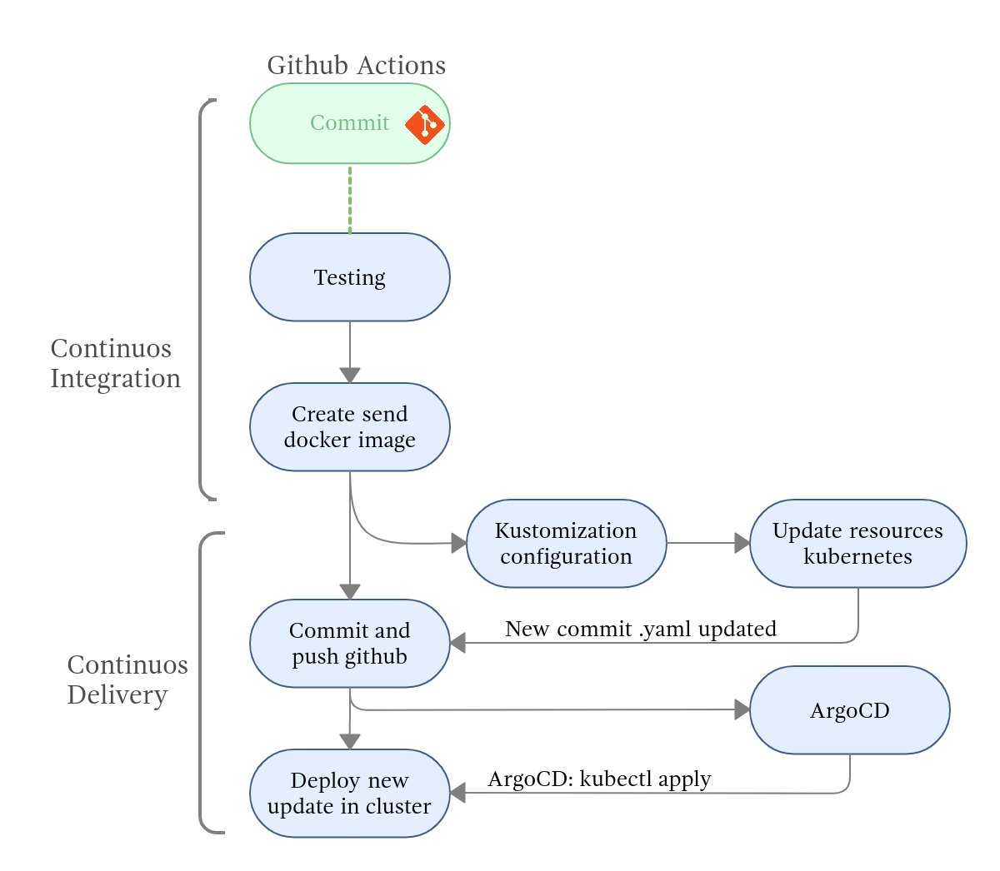

# CI/CD (Github Actions- Argo CD)
Pipeline CI/CD con ArgoCD como herramienta de GitOps, GitHub actions como canalización de CICD y Kustomize para describir las implementaciones de aplicaciones(editar los manifiestos declarativos con la ultima imagen docker)

Es importante primero instalar ArgoCd en el cluster y luego ejecutar aplicacion que se encuentra en el directorio /app-argocd.

```
kubectl apply -f 00-aplicacion.yaml
```

Luego realizar commit en repositorio pertinente.

## Pipeline CI/CD



